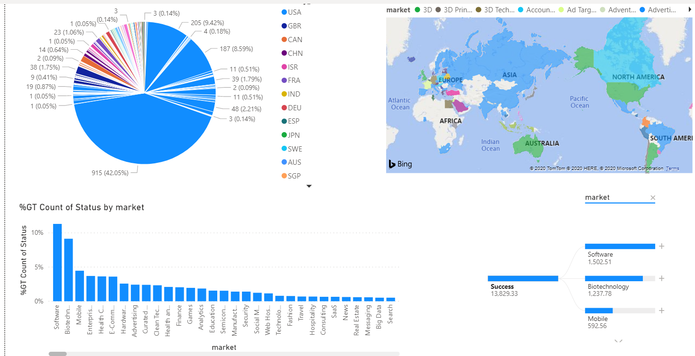
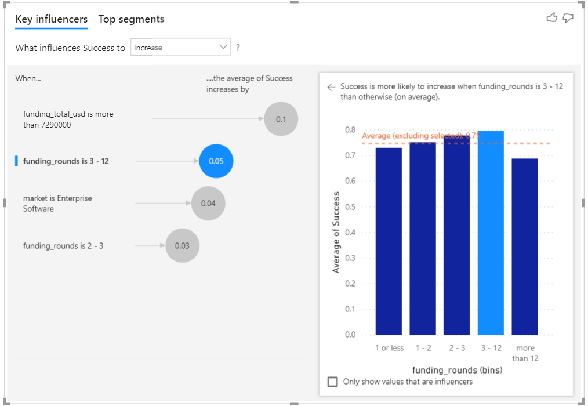
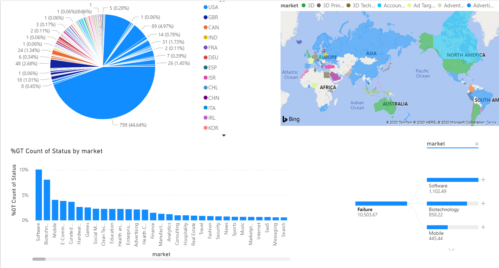
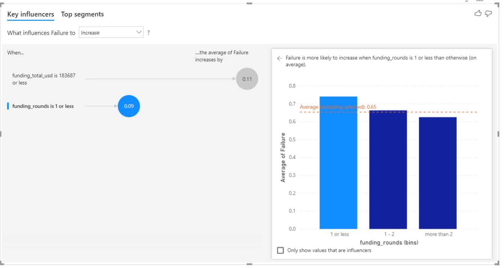
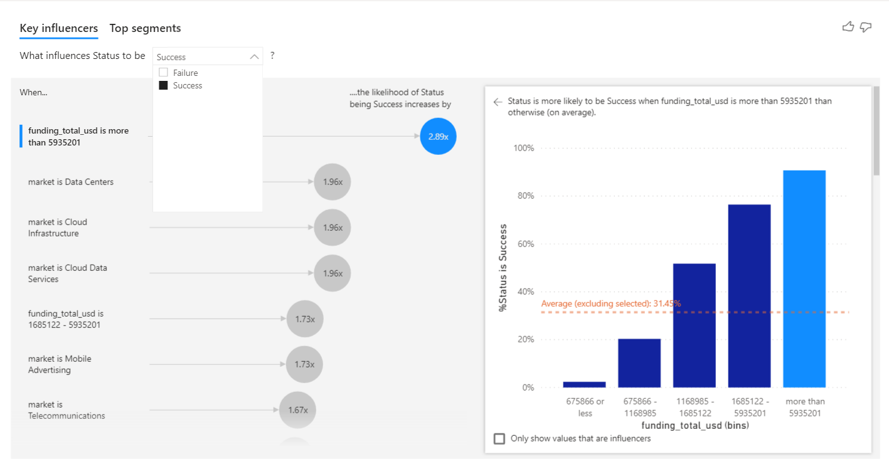

# Data-Visualization-Startup-Data
Data Visualization of Startup Data (Kaggle Crunchbase Project) using Power BI. For detailed project information : https://www.kaggle.com/arindam235/startup-investments-crunchbase

Power BI is a powerful tool for Data Anaylsis and Visualization. On the given data of startups, after Data cleaning I found below insights:

Success Data Visualization on the basis of region & market  

Failure Data visualization  

Combined Visualization 

